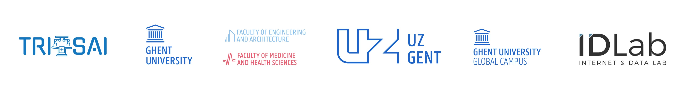

**Training and Research Institute for Surgical Artificial Intelligence (TRISAI)**  

TRISAI is an interdisciplinary training and research institute at
<a href="https://www.ugent.be">Ghent University</a> dedicated to advancing the
development and clinical translation of AI in surgery.
Our institute brings together healthcare professionals and engineers who work
collaboratively to push the boundaries of AI research, education, and innovation
in surgical care.

Our primary research focus lies in **computer vision for surgery**, with a strong
emphasis on translational and clinical research. We pursue AI methods and systems
that aim to improve surgical performance, support clinical decision‑making, and
ultimately enhance patient outcomes. Through an interdisciplinary approach, we
seek to develop robust and clinically meaningful AI technologies that can be
applied in real‑world surgical settings.

In addition to research, TRISAI actively contributes to **training and education**.
We organize workshops and learning activities for students, healthcare
professionals, and engineers who wish to explore the applications of AI and
data‑driven methods in surgery.

TRISAI is committed to **responsible and trustworthy AI**. We recognize the
importance of ethics, transparency, and reliability in medical AI research and
collaborate with international partners to uphold high standards in the
development and evaluation of surgical AI systems.

🔗 **Learn more about TRISAI <a href="https://trisai.ugent.be/about.html">here</a>**

  

